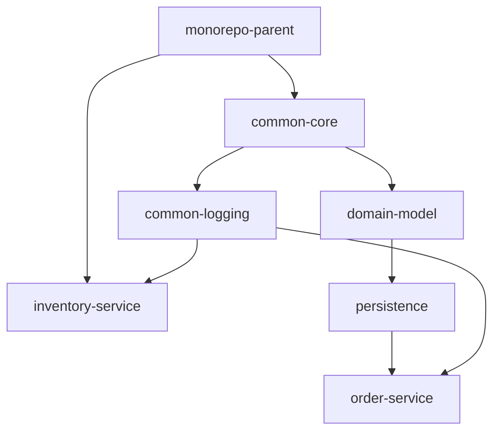

# Architecture & Design Guide

## Architectural Overview

This repository uses a **hybrid Nx + Maven architecture**:
- **Nx** handles task graph dependency construction, computation caching, parallel execution, and affected task filtering.
- **Maven** owns compilation, test execution, code formatting, code coverage, and JAR packaging.



*Note: The project dependency graph is auto-generated by the `nx-maven` plugin and can be inspected anytime via `npx nx graph`.*

---

## Key Design Principles

### 1. No Delegation to Maven Reactor
Nx builds one module at a time (`mvn install -DskipTests -f <path>/pom.xml`) from the workspace root. Nx does not invoke standard multi-module reactor builds per task.

### 2. Relocated Local Repository (`.m2/repository`)
Maven local repository is relocated into `.m2/repository` inside the workspace root via `.mvn/maven.config`:
```
-Dmaven.repo.local=.m2/repository
```
Each module's `build` target declares both its target folder and installed local repository path as outputs:
```json
"outputs": [
  "{projectRoot}/target",
  "{workspaceRoot}/.m2/repository/com/acme/${artifactId}"
]
```
This ensures that when Nx restores a module build from cache, it restores both the compiled target directory and the `.m2/repository` JAR artifacts.

> **Note**: Because `-Dmaven.repo.local=.m2/repository` uses a relative path, manual `./mvnw` commands must be executed from the repository root (e.g. `./mvnw -f libs/common-core/pom.xml ...`). Nx targets automatically handle this.

### 3. Zero-Lock-In
Deleting `nx.json`, `package.json`, and `tools/` leaves a 100% standard Maven multi-module project where `./mvnw verify` at the root builds the entire repository seamlessly.

---

## Adding a New Module

To add a new library or application module to the monorepo:

1. **Create the module directory**:
   e.g. `libs/payment-core` or `apps/payment-service`.

2. **Create `pom.xml`**:
   Inherit from `monorepo-parent`:
   ```xml
   <?xml version="1.0" encoding="UTF-8"?>
   <project xmlns="http://maven.apache.org/POM/4.0.0"
            xmlns:xsi="http://www.w3.org/2001/XMLSchema-instance"
            xsi:schemaLocation="http://maven.apache.org/POM/4.0.0 http://maven.apache.org/xsd/maven-4.0.0.xsd">
     <modelVersion>4.0.0</modelVersion>

     <parent>
       <groupId>com.acme</groupId>
       <artifactId>monorepo-parent</artifactId>
       <version>1.0.0-SNAPSHOT</version>
       <relativePath>../../pom.xml</relativePath>
     </parent>

     <artifactId>payment-core</artifactId>
     <packaging>jar</packaging>
   </project>
   ```

3. **Register in root `pom.xml`**:
   Add the module under `<modules>` in root `pom.xml`:
   ```xml
   <module>libs/payment-core</module>
   ```

4. **Register in `<dependencyManagement>` (Optional)**:
   Add entry in root `pom.xml` for version management across modules:
   ```xml
   <dependency>
     <groupId>com.acme</groupId>
     <artifactId>payment-core</artifactId>
     <version>${project.version}</version>
   </dependency>
   ```

5. **No extra Nx configuration required!**
   The custom Nx inference plugin (`tools/nx-maven/index.js`) automatically globs for new `pom.xml` files, registers targets, and infers dependency graph edges.
